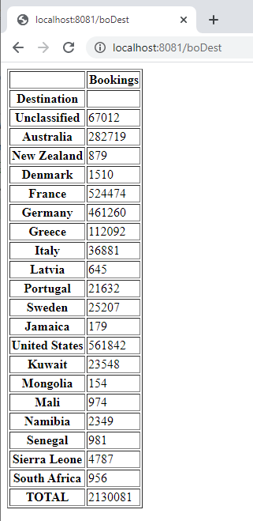

# orbit-flagarray-combinations

A very simple example application that connects to the Apteco Orbit API (see https://github.com/Apteco/AptecoAPIGuides) via the apteco python package (see https://github.com/Apteco/py-apteco)

This will start up a Flask webserver on port 8081.  when you request the root page (e.g. http://localhost:8081) this will connect to an API running the demo "Holidays" dataset and product a 1D cube output of the Income variable.


You can also visit  http://localhost:8081/{variable_name} (where the named variable must be a plain selector variable) to see the details for that variable too.



I will look to extend this in the near future to support other cases.

# Prerequisites

- Python 3 is required

# Getting started

To get started, simply do the following:

* pip install flask
* pip install apteco

Then run the application with some command line parameters:

`$> python app.py [API base url] [dataview] [systemname] [username] [password]`

For example:

```
$> python app.py https://www.tealgreenholidays.co.uk/OrbitAPI CloudDemo CloudDemo username password
```

Finally - browse to http://localhost:8081 and off you go...